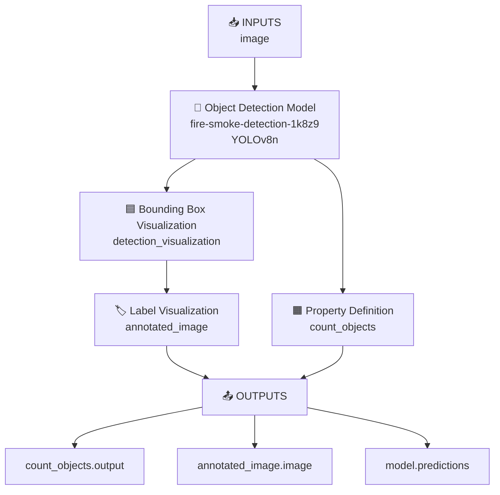

# 🔥 Fire & Smoke Detection — YOLOv8 (UC17)

## 📌 Project Overview
A real-time fire and smoke detection system built using 
YOLOv8 as part of the Vision Technology Internship at 
St. John College of Engineering and Management, Mumbai.

Developed under the YOLOvX-Based Real-World Object Detection 
and Deployment internship program.

---

## 🎯 Use Case
**UC17 — Fire/Smoke Detection**
Detect fire and smoke in real-time using camera feeds for 
early hazard detection and safety alerts.

---

## 🔁 Roboflow Deployment Workflow


### Workflow Node Details
| Node | Type | Description |
|------|------|-------------|
| **Inputs** | Input Node | Accepts image for processing |
| **model** | Object Detection | YOLOv8n detects fire & smoke |
| **detection_visualization** | Bounding Box | Draws boxes on detected objects |
| **count_objects** | Property Definition | Counts fire/smoke instances |
| **annotated_image** | Label Visualization | Adds labels & confidence scores |
| **Outputs** | Output Node | Returns final results |

### Output Details
| Output | Description |
|--------|-------------|
| `count_objects.output` | Number of fire/smoke instances found |
| `annotated_image.image` | Image with bounding boxes drawn |
| `model.predictions` | Raw prediction data with confidence |

---

## 📋 Complete Pipeline

### Phase 1 — Problem Definition
- Detection Task: Fire and Smoke identification
- Target Environment: Indoor/Outdoor camera feeds
- Classes: `fire`, `smoke`
- Success Criteria: mAP > 65%, real-time inference

### Phase 2 — Dataset Preparation
- Source: Roboflow Universe
- Original Images: 5,068
- After Augmentation: 12,122 images
- Image Size: 640 x 640
- Train / Val / Test Split: 70% / 20% / 10%
- Augmentations: Flip, Blur, Brightness, Grayscale

### Phase 3 — Model Training
- Framework: Ultralytics YOLOv8
- Model: YOLOv8n (nano)
- Epochs: 50
- Batch Size: 16
- Image Size: 640
- Hardware: Google Colab T4 GPU (Free)
- Optimizer: AdamW (lr=0.001667, momentum=0.9)
- Parameters: 3,006,038
- GFLOPs: 8.1

### Phase 4 — Evaluation & Results
| Metric | Overall | Fire | Smoke |
|--------|---------|------|-------|
| mAP@50 | 66.3% | 91.2% | 41.5% |
| Precision | 67.7% | 87.3% | 48.1% |
| Recall | 64.0% | 89.6% | 38.1% |
| F1 Score | 65.8% | — | — |
| Inference Speed | 4.4ms/image | — | — |

### Phase 5 — Deployment
- Platform: Roboflow Serverless API
- Model Type: YOLOv8n Upload
- Workflow: Detect, Count and Visualize
- Inference: Real-time capable (~227 FPS)
- Output: Annotated image + object count + predictions
- Live Demo: [Click Here](https://app.roboflow.com/space-3jvwp/fire-smoke-detection-1k8z9-vpblh/1)

---

## 🛠️ Tech Stack
| Tool | Purpose |
|------|---------|
| YOLOv8n (Ultralytics) | Object Detection Model |
| Google Colab T4 GPU | Free GPU Training |
| Roboflow Universe | Dataset Collection |
| Roboflow Platform | Annotation + Deployment |
| Roboflow Workflows | Serverless API Pipeline |
| Python 3.12 | Programming Language |
| GitHub | Version Control |

---

## 🚀 How To Run Locally

### Install Dependencies
```bash
pip install ultralytics roboflow
```

### Run Detection on Image
```python
from ultralytics import YOLO

model = YOLO('best.pt')
results = model.predict(
    source='your_image.jpg',
    conf=0.25,
    show=True
)
```

### Run on Webcam
```python
from ultralytics import YOLO

model = YOLO('best.pt')
results = model.predict(
    source=0,
    conf=0.25,
    show=True
)
```

### Run via Roboflow API
```python
from roboflow import Roboflow

rf = Roboflow(api_key="YOUR_API_KEY")
project = rf.workspace("space-3jvwp").project(
    "fire-smoke-detection-1k8z9-vpblh"
)
version = project.version(1)
model = version.model

result = model.predict("your_image.jpg", confidence=25).json()
print(result)
```

---

## 📁 Repository Structure

```
fire-smoke-detection-yolov8/
├── fire_smoke_detection_yolov8.ipynb
├── best.pt
├── README.md
└── results/
    ├── results.png
    └── detection_sample.png
```

---

## 🔗 Project Links
| Resource | Link |
|----------|------|
| Live Demo | [Roboflow Deploy](https://app.roboflow.com/space-3jvwp/fire-smoke-detection-1k8z9-vpblh/1) |
| Dataset | [Roboflow Universe](https://universe.roboflow.com/space-3jvwp/fire-smoke-detection-1k8z9-vpblh) |
| Notebook | [Google Colab](your-colab-link-here) |
| GitHub | [Repository](https://github.com/mohak1206/fire-smoke-detection-yolov8) |

---

## 🏫 Internship Details
- College: St. John College of Engineering and Management
- Program: Vision Technology Internship
- Use Case: UC17 — Fire/Smoke Detection
- Framework: YOLOvX Based Real-World Object Detection
